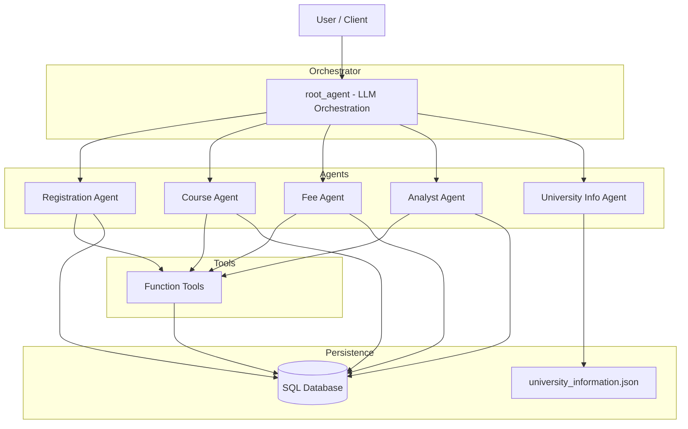
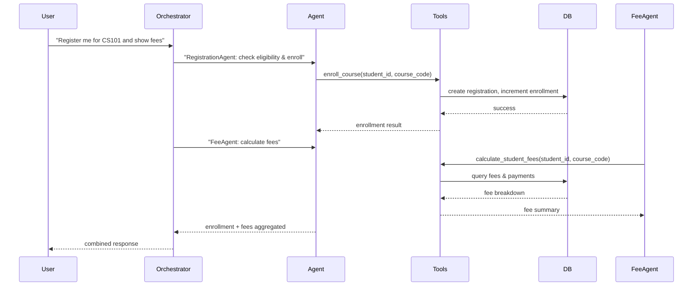

# **AI University Campus Admin Agent**
- **Location**: `ai_university_campus_admin_agent`
- **Purpose**: A modular, agent-based system that automates common university administrative tasks (registration, course management, fees, analytics, and campus information) using Google ADK (Agents Developer Kit) and an SQL database backend.
---
### **Features**
- **Multi-agent orchestration**: Central orchestration agent routes user requests to specialized agents.
- **Specialized agents**: Registration, Course, Fee, Analyst, and University Information agents handle domain-specific tasks.
- **Custom tool based actions**: Each agent uses FunctionTools wrapping CRUD and reporting helpers (in `ai_university_campus_admin_agent/tools`).
- **Persistent storage**: SQLAlchemy models in `ai_university_campus_admin_agent/config/database.py` provide a full schema (students, courses, registrations, payments, fee structures, logs).
- **Data-driven campus info**: `ai_university_campus_admin_agent/data/university_information.json` contains campus contacts, departments, and facilities consumed by the University Information agent.
- **Google ADK integration**: Uses `google.adk` and `google.genai` components (see `agent.py`) to create LLM-driven agents.
---
### **Repository Layout (key files)**
- **`agent.py`**: Central orchestration agent setup and instructions for the root LLM agent (the orchestrator).
- **`agents/`**: Specialized agents, each built as an `LlmAgent` or `Agent`:
  - `registration_agent.py` — student lifecycle, enrollment, profile management.
  - `course_agent.py` — course CRUD, enrollments, drop operations.
  - `fee_agent.py` — fee structures, payment recording, queries.
  - `analyst_agent.py` — analytics, reports and data insights.
  - `uni_information_agent.py` — campus information provider (reads `data/university_information.json`).
- **`tools/`**: Helper functions used as `FunctionTool` callables by agents (e.g., `create_student`, `enroll_course`, `get_enrollment_statistics`).
- **`config/database.py`**: SQLAlchemy models and `get_db()` / `init_db()` utilities.
- **`data/university_information.json`**: Campus metadata used by the information agent.
- **`requirements.txt`**: Python dependencies (FastAPI, SQLAlchemy, python-dotenv, etc.).
---
### **How It Works**
- **User request**: A user or calling application sends a natural-language request.
- **Orchestration**: The `root_agent` (in `agent.py`) analyzes intent and chooses which specialized agent(s) to call.
- **Tools invocation**: The selected agents call `FunctionTool` wrappers implemented in `tools/*` to access the database or compute results.
- **Database**: `config/database.py` exposes ORM models (Students, Courses, Registrations, Payments, FeeStructures, ActivityLog, etc.) and `get_db()` for sessions.
- **Response aggregation**: If a request involves multiple domains (e.g., pay fees and register for a course), the orchestrator coordinates multiple agents and merges results into a single conversational reply.
---
### **Design & Orchestration Diagram**

---
### **Request Flow**

---
### **Agents & Responsibilities**
- **Registration Agent (`agents/registration_agent.py`)**: Create/update/delete students; enroll/drop students; returns registration objects. Uses tools: `create_student`, `enroll_course`, `get_student_registrations`, etc.
- **Course Agent (`agents/course_agent.py`)**: Course lifecycle: create, read, update, list, drop. Uses tools: `create_course`, `get_course`, `get_all_courses`, `update_course`.
- **Fee Agent (`agents/fee_agent.py`)**: Create fee structures, calculate dues, record payments, get history. Tools include `create_fee_structure`, `calculate_student_fees`, `record_payment`, `get_payment_history`.
- **Analyst Agent (`agents/analyst_agent.py`)**: Reporting and analytics endpoints (enrollment stats, financial reports, activity reports, course performance). Tools aggregate DB queries and return JSON reports.
- **University Information Agent (`agents/uni_information_agent.py`)**: Reads `data/university_information.json` and answers campus-related queries.
---
### **Database & Models**
- **Models**: `Student`, `Course`, `Registration`, `Payment`, `FeeStructure`, `ActivityLog`, `Department`, `AcademicRecord`, `Notification`.
- **Enums** used: `ActivityType`, `RegistrationStatus`, `FeeType`, `PaymentStatus`.
- **Session**: `get_db()` yields SQLAlchemy sessions. Run `init_db()` to create tables.
---
### **Google ADK Integration**
- The project uses `google.adk` and `google.genai` components (see `agent.py`) to create `LlmAgent` instances and `FunctionTool` wrappers. See the ADK docs: https://google.github.io/adk-docs/
- `agent.py` constructs `root_agent` with `sub_agents` set to the specialized agents. The orchestration instruction prompt is defined there.
---
### **Setup & Running (Development)**
- **Prerequisites**: Python 3.10+, virtualenv, Google ADK credentials/config (per ADK docs), and an SQL database (SQLite, Postgres, etc.).
- **Install dependencies (PowerShell)**
```powershell
pip install -r "ai_university_campus_admin_agent\requirements.txt"
``` 
- **Environment variables** (use a `.env` file in the project root):
  - `DATABASE_URL` — e.g. `sqlite:///ai_university_campus_admin_agent/database/university.db` or a Postgres DSN.
  - ADK / Google GenAI credentials (follow ADK docs for required env vars / auth).

- **Initialize database**
```powershell
python ai_university_campus_admin_agent\config\database.py
```

- **Run a quick orchestrator test (example script)**
```python
adk run
```
